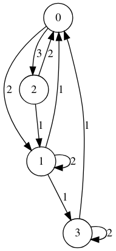

# Discrete Mathematics - Assignment 2
> *Submitted By* :
>
> *Samin Tejas* , BCs cohort 4
>
> email : 2024eb01133@online.bits-pilani.ac.in

## Sol 1 : 
both cases can be demonstrated using pigeonhole principle.
### case a
We have 9 students in total and lets consider 2 categories male and female.
if we assume that there are fewer than 5 male students and fewer than 5 female students , then  
- male students $\le 4$
- female students $\le 4$

but if we add up , ie $4+4 = 8$ which is less than the total number of students 9.
This contradiction shows that our assumption must be false.
so there must be atlease 5 male students or atleast 5 female students

### case b 

We have 9 students in total and lets consider 2 categories male and female.
lets assume that there are fewer than 43 male students and fewer than 7 female students, then 
- male students $\le 2$
- female students $\le 6$

the maximum total under this assumption would be $2 + 6 = 8$ students
this is a contradiction since we know the total students are 9.
there there must be atleast 3 male students and 7 female students.

## Sol 2 :

#### Base case: 
if the string $s$ is empty then the number of ones is zero. 
    ie.
$$
ones(\varepsilon) = 0
$$

#### Recirsive step: 
if the string s is not empty, we can write $s$ as $cs'$, 
where $c$ is the first character of the string and $s'$ is the substring which doesnt contain $c$

if $c = 0$ ,
$$
ones(0s') = 1 + ones(s')
$$

do the recursive defenition of the function is
$$
ones(\varepsilon) = 0
$$

$$
ones(0s') = ones(s') 
$$

$$
ones(1s') = 1 + ones(s')
$$

## Sol 3 :

For a given matrix the element curresponds to the number of connection between the element cordinate.
in this case the element $a(0,2)$ represents $2$ which means there are 2 connection from vertex 0 to 2.

## Sol 4 : 

- $G$ and $H$ are isomorphic simple graphs.
- Let $\phi: V(G) \rightarrow V(H) $ be the isomorphism between $G$ and $H$.

#### Proof:

   for any $u, v \in V(G) $,

   $$
   \{u, v\} \in E(G) \iff \{\phi(u), \phi(v)\} \in E(H).
   $$

   - For the complements, $\overline{G}$ and $\overline{H}$ :

     $$
     \{u, v\} \in E(\overline{G}) \iff \{u, v\} \notin E(G).
     $$

     $$
     \{u, v\} \in E(\overline{H}) \iff \{u, v\} \notin E(H).
     $$

   - Given the isomorphism $\phi$  if $ \{u, v\} \notin E(G) $, then $ \{\phi(u), \phi(v)\} \notin E(H) $.
   - This means $ \{u, v\} \in E(\overline{G}) \iff \{\phi(u), \phi(v)\} \in E(\overline{H}) $.

   - $ \phi $ is bijective, hence every vertex in $ \overline{G} $ maps uniquely to a vertex in $ \overline{H} $.

Thus,
$$
\boxed{\text{If } G \cong H, \text{ then } \overline{G} \cong \overline{H}.}
$$
